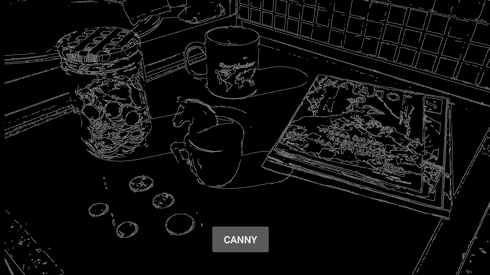

# edge-detection
A semester project for general edge detection algorithm implementations ☺️

Here are some demos. Original Image, Canny and Sobel, respectively.

  
  
  

## How To Use
- In Android Folder, you can find the three needed folders for an app to compile in Studio. You also need to import OpenCV 3.4.5 Android Library.

- In Sobel Folder, you can simply apply edge detection; with just chancing the source image according to your directory. A simple Anaconda Enviroment will do the trick :)
